<div align="center">

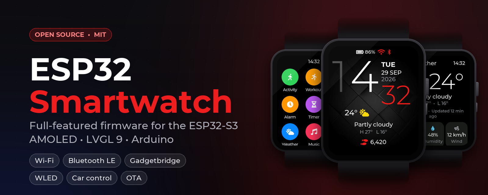

# ESP32 Smartwatch

### Open-source smartwatch firmware for the ESP32-S3: a smooth LVGL 9 touch UI on a 1.8" AMOLED

Watch faces, always-on display, notifications, fitness and sleep tracking, weather, music, alarms, Wi-Fi and Bluetooth LE, plus WLED smart lights and car control.
Built with Arduino for the **Waveshare ESP32-S3-Touch-AMOLED-1.8**.

[](LICENSE)
[](https://github.com/muki01/ESP32-Smartwatch/stargazers)
[](https://github.com/muki01/ESP32-Smartwatch/network/members)
[](https://github.com/muki01/ESP32-Smartwatch/commits)
<br>
[](https://www.espressif.com/en/products/socs/esp32-s3)
[](https://lvgl.io)
[](https://github.com/espressif/arduino-esp32)
[](#-phone-connection-gadgetbridge)
[](CONTRIBUTING.md)

[**Features**](#-features) ·
[**Screenshots**](#-screenshots) ·
[**Hardware**](#-hardware) ·
[**Getting started**](#-getting-started) ·
[**Phone app**](#-phone-connection-gadgetbridge) ·
[**Architecture**](#-architecture) ·
[**Contributing**](#-contributing)

</div>

<br>

<table>
<tr>
<td align="center" width="33%">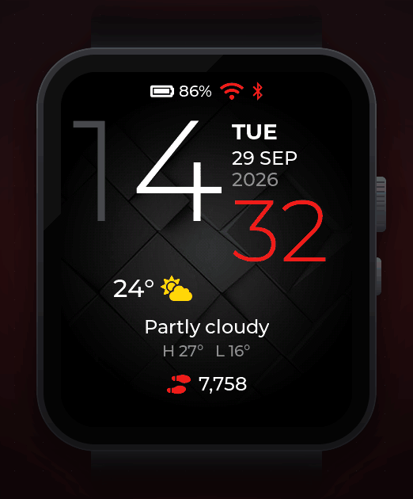<br><b>Fluid navigation</b><br><sub>Swipe between the watch face, quick settings, apps and tiles</sub></td>
<td align="center" width="33%">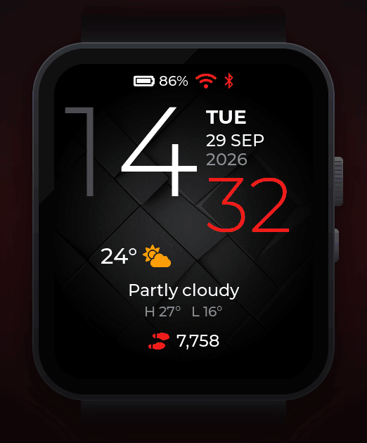<br><b>Real apps</b><br><sub>Timer, sleep, music, settings and more</sub></td>
<td align="center" width="33%">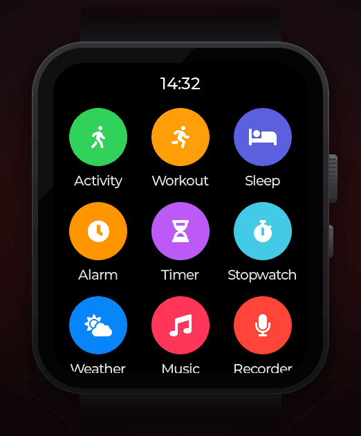<br><b>Smart home and car</b><br><sub>WLED lights, clap control, car module</sub></td>
</tr>
</table>

## ✨ Highlights

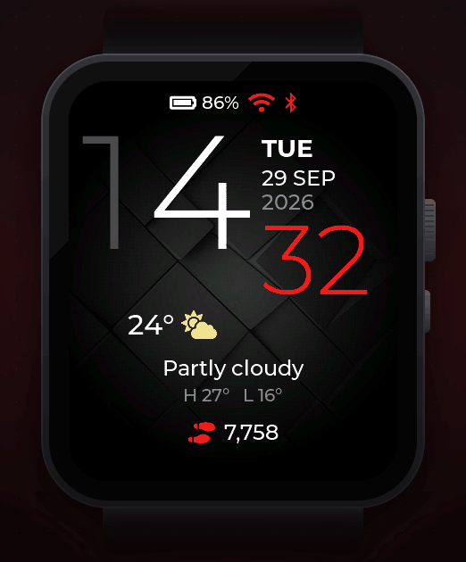

- **A complete smartwatch, not a demo.** Four watch faces with an always-on display, 11 built-in apps, notifications, quick settings, alarms that really ring and a full Settings app.
- **Works with your phone.** Notifications, calls, music control, weather, calendar and time sync through [Gadgetbridge](https://gadgetbridge.org) on Android, with no custom app to install.
- **Smooth on a microcontroller.** Page transitions run on snapshots, the app launcher is pre-rendered, LVGL's hot paths run from IRAM and the draw buffers stay in internal DMA RAM. See [Performance](#-performance).
- **Smart home and car extras.** Control [WLED](https://kno.wled.ge) lights on your Wi-Fi (they are found automatically), toggle them with a double clap, and drive a car module over Wi-Fi.
- **Wakes like a real watch.** Raise to wake, lower to sleep, tap to wake, bedtime mode and battery saver.
- **Clean, layered code base.** Drivers, services and UI are separated, and the firmware compiles with zero warnings under `-Wall -Wextra`.
- **Wireless updates.** Flash new firmware from a web browser, no cable needed.
- **UI preview on your PC.** Every screen in this README is rendered from the firmware's own code by [`tools/preview`](tools/README.md#pc-preview), so you can check UI changes without flashing.

<br clear="right">

## 📸 Screenshots

<div align="center">
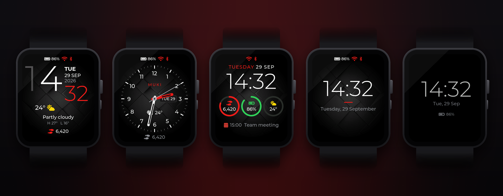
<br><sub>Digital, Analog, Modular and Minimal watch faces, and the always-on display</sub>
</div>

<br>

<table>
<tr>
<td align="center">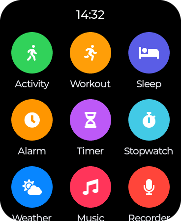<br><sub>App launcher</sub></td>
<td align="center">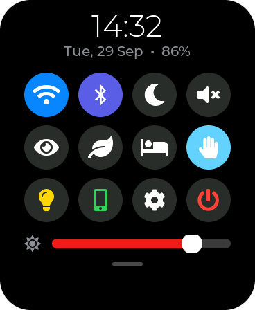<br><sub>Quick settings</sub></td>
<td align="center">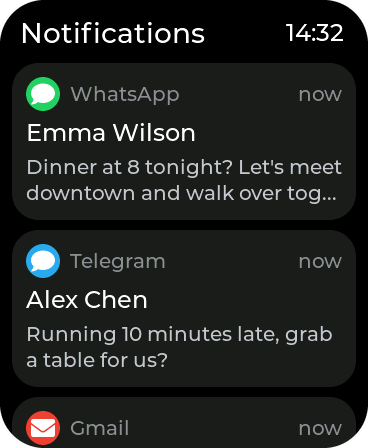<br><sub>Notifications</sub></td>
<td align="center">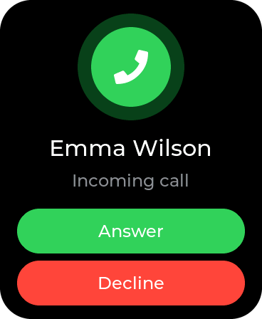<br><sub>Incoming call</sub></td>
</tr>
<tr>
<td align="center">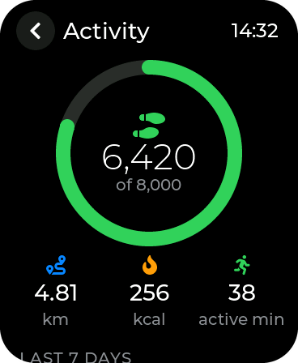<br><sub>Activity</sub></td>
<td align="center">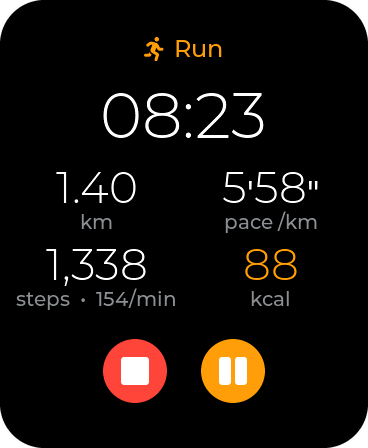<br><sub>Workout</sub></td>
<td align="center">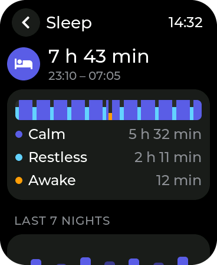<br><sub>Sleep</sub></td>
<td align="center">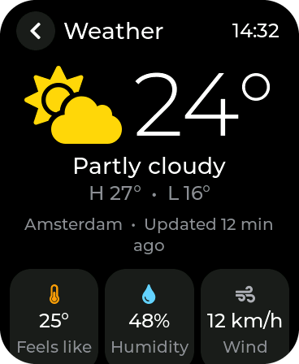<br><sub>Weather</sub></td>
</tr>
<tr>
<td align="center">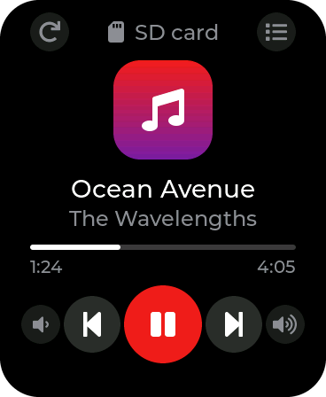<br><sub>Music</sub></td>
<td align="center">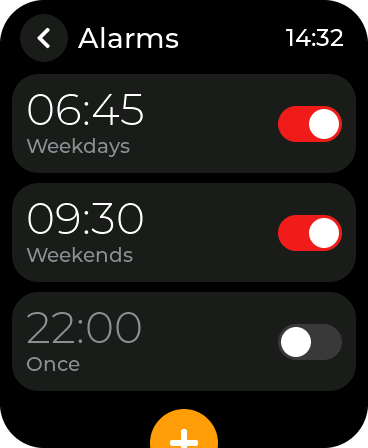<br><sub>Alarms</sub></td>
<td align="center">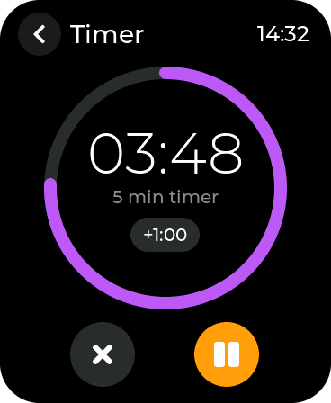<br><sub>Timer</sub></td>
<td align="center">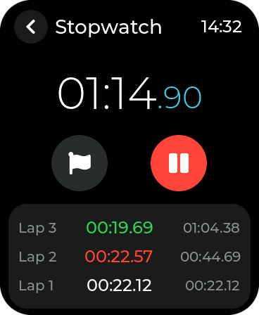<br><sub>Stopwatch</sub></td>
</tr>
<tr>
<td align="center">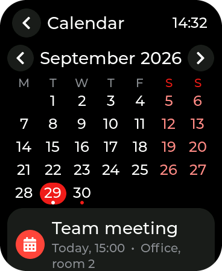<br><sub>Calendar</sub></td>
<td align="center">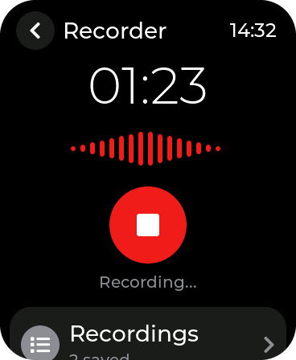<br><sub>Recorder</sub></td>
<td align="center">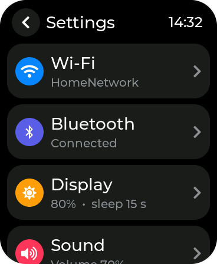<br><sub>Settings</sub></td>
<td align="center">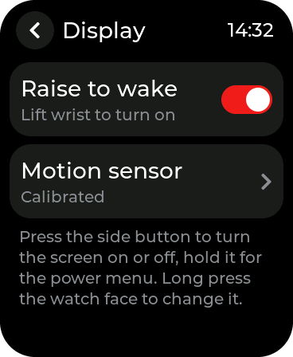<br><sub>Raise to wake</sub></td>
</tr>
</table>

<div align="center">
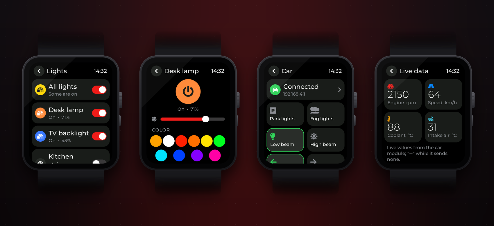
<br><sub>Extras: WLED lights (on/off, brightness, colour, effects) and car control with live engine data</sub>
</div>

<p align="center"><b><a href="docs/SCREENSHOTS.md">📷 See all 70 screens in the gallery</a></b></p>

## 🧩 Features

| | |
| --- | --- |
| ⌚ **Watch faces** | Digital, Analog, Modular (steps, battery, weather, next event) and Minimal; nine accent colours, texture or pure black; always-on display with burn-in protection |
| 👆 **Wake up** | Raise to wake (lower the wrist to turn it off again), tap to wake, side button; bedtime mode keeps the screen dark at night |
| 🔔 **Notifications** | Banners with sound, notification center, detail view, dismiss synced with the phone, do not disturb, silent mode |
| 📞 **Phone** | Incoming call alert with answer and decline, music control, find my phone and find my watch |
| 🏃 **Activity** | Step counter (robust against shaking), distance, calories, active minutes, daily goal, 7-day history, move reminder |
| 💪 **Workout** | Walk, run, hike or other; live time, distance, pace, steps, cadence and calories; history |
| 😴 **Sleep** | Automatic sleep detection from wrist movement with calm, restless and awake phases; 7-night chart; bedtime schedule |
| ⏰ **Time** | Alarms with repeat days and snooze, timer, stopwatch with laps, calendar from the phone, automatic time and time zones |
| 🌤️ **Weather** | [Open-Meteo](https://open-meteo.com) forecast with no API key: now, next hours, 5 days, sunrise, sunset, UV; automatic location or any city |
| 🎵 **Media** | Music player for WAV files on the microSD card, voice recorder |
| ⚙️ **System** | Quick settings, battery saver, brightness, volume, units (metric or imperial), 24-hour clock, motion sensor calibration, FPS monitor, factory reset |
| 🔄 **Updates** | Wireless firmware update from any web browser, protected by a PIN shown on the watch |
| 💡 **Lights** *(extra)* | WLED devices on your Wi-Fi, found via mDNS or added by IP: power, brightness, colour, effects, all on or off |
| 👏 **Clap control** *(extra)* | A double clap toggles all lights; a microphone icon shows while it listens |
| 🚗 **Car control** *(extra)* | Lights, turn signals and wipers of a car module over Wi-Fi, live RPM, speed and temperatures |

Extras are off by default and appear in the app list once enabled in **Settings › Extras**.

## 🔧 Hardware

The firmware targets the [**Waveshare ESP32-S3-Touch-AMOLED-1.8**](https://www.waveshare.com/esp32-s3-touch-amoled-1.8.htm) development board ([wiki](https://www.waveshare.com/wiki/ESP32-S3-Touch-AMOLED-1.8)). It has everything a smartwatch needs on one small board:

| Component | Part | Used for |
| --- | --- | --- |
| MCU | ESP32-S3R8, dual-core 240 MHz, 16 MB flash, 8 MB PSRAM | Everything |
| Display | 1.8" AMOLED, 368 × 448, SH8601 (QSPI) | UI, always-on display |
| Touch | FT3168 capacitive | Touch, tap to wake |
| Power | AXP2101 PMU, Li-Po battery connector | Battery level, charging, side button |
| Motion | QMI8658 6-axis IMU | Steps, raise to wake, sleep tracking |
| Clock | PCF85063 RTC | Time while powered off |
| Audio | ES8311 codec, speaker, microphone | Alarms, music, recorder, clap control |
| Storage | microSD (SDMMC) | Music and recordings |
| Wireless | Wi-Fi 4, Bluetooth 5 LE | Weather, WLED, updates, phone |

## 🚀 Getting started

### 1. Install the tools

1. Install the [Arduino IDE 2](https://www.arduino.cc/en/software).
2. Add the Espressif boards: *File › Preferences › Additional boards manager URLs*:
   `https://espressif.github.io/arduino-esp32/package_esp32_index.json`,
   then install **esp32 by Espressif Systems 3.3.x** in the Boards Manager.
3. Install these libraries from the Library Manager:

| Library | Version | Purpose |
| --- | --- | --- |
| [lvgl](https://github.com/lvgl/lvgl) | 9.6.x | User interface |
| [XPowersLib](https://github.com/lewisxhe/XPowersLib) | 0.3.x | AXP2101 power management |
| [SensorLib](https://github.com/lewisxhe/SensorLib) | 0.3.x | QMI8658 motion sensor |
| [NimBLE-Arduino](https://github.com/h2zero/NimBLE-Arduino) | 2.x | Bluetooth LE |
| [ArduinoJson](https://arduinojson.org) | 7.x | Phone link, weather, WLED |

LVGL is configured by [`Smartwatch/lv_conf.h`](Smartwatch/lv_conf.h). Remove any other `lv_conf.h` from your Arduino `libraries` folder.

### 2. Build and upload

1. Clone the repository and open `Smartwatch/Smartwatch.ino`.
2. Select these settings in the *Tools* menu:

| Setting | Value |
| --- | --- |
| Board | Waveshare ESP32-S3-Touch-AMOLED-1.8 |
| PSRAM | Enabled |
| Partition Scheme | Custom (uses `Smartwatch/partitions.csv`: two app slots for wireless updates) |
| USB CDC On Boot | Enabled |

3. Click **Upload**. The serial monitor (115200 baud) shows the boot log.

<details>
<summary>Build from the command line (arduino-cli)</summary>

```sh
cd Smartwatch
arduino-cli compile --upload -p <PORT> \
  --fqbn "esp32:esp32:waveshare_esp32_s3_touch_amoled_18:PSRAM=enabled,PartitionScheme=custom,CDCOnBoot=cdc" .
```

</details>

### 3. First steps on the watch

| Gesture | Action |
| --- | --- |
| Swipe up | App launcher |
| Swipe down | Quick settings |
| Swipe right | Notifications |
| Swipe left | Tiles: activity, weather, music |
| Long press the watch face | Choose and customize the watch face |
| Swipe right on a page | Back |
| Side button | Screen on or off; hold for the power menu |
| BOOT button | Home; on the watch face it opens the apps |

1. **Settings › Wi-Fi**: connect to your network. Time and weather are set up automatically.
2. **Settings › Bluetooth**: turn on *Phone link* and pair Gadgetbridge (below).
3. **Settings › Display › Motion sensor**: calibrate once (lay the watch flat, then hold it upright) for the most reliable raise to wake.
4. For music, copy `.wav` files to a `music` folder on a microSD card (named `Artist - Title.wav`).

## 📱 Phone connection (Gadgetbridge)

The watch speaks the Bangle.js protocol, so the free and open-source Android app [Gadgetbridge](https://gadgetbridge.org) ([F-Droid](https://f-droid.org/packages/nodomain.freeyourgadget.gadgetbridge/)) works with it out of the box:

1. On the watch: **Settings › Bluetooth**, turn on **Phone link**. The watch now advertises as `Bangle.js Muki`.
2. In Gadgetbridge: tap **+**, select `Bangle.js Muki` and pair.

Supported: notifications (with dismiss), incoming calls (answer and decline), music info and controls, weather, calendar events, find my phone and find my watch, time and time zone sync, battery level on the phone.

The watch also offers the standard Bluetooth Battery, Device Information and Current Time services.

## 💡 Extras

<details open>
<summary><b>WLED lights and clap control</b></summary>

Turn on **Settings › Extras › Lights**. The *Lights* app finds WLED devices on the same Wi-Fi (mDNS `_wled._tcp`) or adds them by IP address, and talks to them through the WLED JSON API: power, brightness, colour and effects for each light, plus *All lights*. With **Clap control** on, a double clap switches all lights on or off; the microphone only listens while lights are set up and Wi-Fi is connected, and a microphone icon on the watch face shows it.

</details>

<details>
<summary><b>Car control and the car module protocol</b></summary>

Turn on **Settings › Extras › Car control** and join the car module's Wi-Fi. While the *Car* app is open, the watch connects to `ws://<module>/ws` (default `192.168.4.1`, changeable in the app).

Watch → module, on every button:

```json
{"cmd":"control","name":"low_beam","on":true}
```

Names: `park_lights`, `fog_lights`, `low_beam`, `high_beam`, `left_signal`, `right_signal`, `wipers_1`, `wipers_2`.

Module → watch, whenever it has new values: a JSON text frame with numbers whose keys contain `rpm`, `speed` (km/h), `coolant` and `intake` (°C), at the top level or inside a `LiveData` object. Each value is a number or `{"value": n}`.

</details>

<details>
<summary><b>Wireless firmware update</b></summary>

1. In the Arduino IDE: *Sketch › Export Compiled Binary*.
2. On the watch: **Settings › System › Update**, turn on the updater. The watch shows its address and a 6-digit PIN.
3. Open the address in a browser on the same network, choose the `.bin` file and enter the PIN. The watch installs the update and restarts.

</details>

## 🏗 Architecture

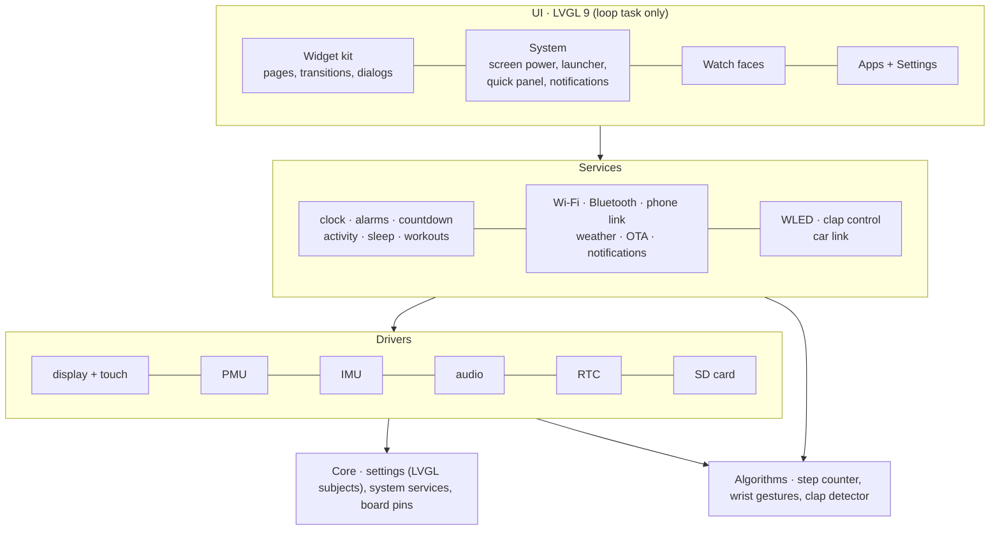

```
Smartwatch/
├── Smartwatch.ino        setup() and loop() only
├── lv_conf.h             LVGL configuration
├── partitions.csv        flash layout with two OTA slots
└── src/
    ├── app.cpp           start-up order, main loop, shutdown
    ├── core/             board pins, settings, system services, formatting
    ├── drivers/          display + touch, PMU, motion sensor, audio, RTC, SD card
    ├── algorithms/       step counter, wrist gestures, clap detector (plain C++)
    ├── services/         clock, Wi-Fi, Bluetooth, phone link, weather, activity, sleep,
    │                     alarms, workouts, calendar, OTA, WLED, car link, ...
    ├── ui/
    │   ├── kit/          widget kit: styles, page stack, transitions, dialogs
    │   ├── system/       screen power, navigation, launcher, quick panel, notifications
    │   ├── faces/        watch faces
    │   └── apps/         one file per app; settings/ holds the Settings app
    ├── lvgl_port/        LVGL heap in PSRAM, ESP32 attributes
    └── assets/           fonts, icons and images (generated by tools/)
tools/                    font and image generators
docs/                     screenshots and media
```

**Design rules**

- Drivers and services never touch LVGL objects. They publish state through LVGL subjects (`core/settings.h`) or through callbacks that the UI installs, so every screen updates itself.
- LVGL runs in one task. Background tasks (motion sensor, audio, network, car link) wake the loop when something changes; otherwise the CPU sleeps.
- Every I²C transaction holds one shared lock, because the PMU, touch, RTC, IMU and codec share the bus.

## ⚡ Performance

A 368 × 448 display at 16 bits per pixel is a lot of pixels for a microcontroller without a GPU. These are the measures that keep the UI fluid:

| Technique | Why it matters |
| --- | --- |
| Draw buffers in internal DMA RAM, 2 × up to 64 lines, sized at boot | Rendering and the QSPI transfer overlap; PSRAM would be slower |
| LVGL's blend and fill functions in IRAM, compiled with `-O2` | The ESP32-S3 has a 16 KB instruction cache; flash-resident hot loops stall |
| Single render thread (`LV_OS_NONE`) | No thread hand-offs for every small draw task |
| Page transitions animate two snapshots | Only two bitmaps move instead of two complete widget trees |
| The app launcher is pre-rendered into one image | Scrolling moves a bitmap instead of 13 icons with labels |
| LVGL heap, task stacks and TLS buffers in PSRAM | Internal RAM stays free for Wi-Fi, Bluetooth and DMA |
| 240 MHz while the screen is on, 80 MHz when it is off | Speed when you look, battery life when you don't |

## 🛠 Development

- **Code style:** [`.clang-format`](.clang-format) and [`.editorconfig`](.editorconfig) in the repository root.
- **Fonts, icons and images** are generated by the scripts in [`tools/`](tools/README.md). Add an icon to the list in `tools/gen_fonts.py`, run it, and use `ICON_<NAME>` in the code.
- **PC preview:** `python tools/preview/render.py` builds the real UI for your computer (with the hardware stubbed), renders every screen and regenerates the screenshots, GIFs and banner in `docs/images`.
- **Adding an app:** create `src/ui/apps/<name>_app.cpp` with a `<name>_open()` function that builds a page with `kit_page_create()` and shows it with `kit_page_push()`, declare it in `src/ui/apps/apps.h` and add it to the table in `src/ui/system/launcher.cpp`.

## 🗺 Roadmap

Ideas and planned work. Contributions are welcome:

- [ ] PlatformIO project and CI builds
- [ ] More watch faces and a face editor
- [ ] UI translations
- [ ] Notifications for iOS (ANCS)
- [ ] Support for more ESP32-S3 watch boards

## ❓ FAQ

<details>
<summary><b>Does it work with an iPhone?</b></summary>

Wi-Fi features (time, weather, WLED, updates) work with any phone. Phone notifications currently need Gadgetbridge, which is Android-only.

</details>

<details>
<summary><b>Can I use another ESP32 board?</b></summary>

The code is built for the Waveshare ESP32-S3-Touch-AMOLED-1.8. Other ESP32-S3 boards with PSRAM can be supported by changing the pins in `src/core/board.h` and the display and touch drivers in `src/drivers/`.

</details>

<details>
<summary><b>Raise to wake does not react. What can I do?</b></summary>

Run **Settings › Display › Motion sensor** once. It learns how the motion sensor sits on your board: lay the watch flat, then hold it upright.

</details>

<details>
<summary><b>Do I need an API key for the weather?</b></summary>

No. Weather comes from [Open-Meteo](https://open-meteo.com), and the location is found from your internet connection or chosen by city name.

</details>

## 🤝 Contributing

Bug reports, ideas and pull requests are welcome. Please read [CONTRIBUTING.md](CONTRIBUTING.md) first. If you build the watch, share a photo in the [Discussions](https://github.com/muki01/ESP32-Smartwatch/discussions) or an issue.

## 📄 License

Released under the [MIT License](LICENSE). Fonts: Montserrat (SIL OFL 1.1) and Font Awesome 5 Free (SIL OFL 1.1 / CC BY 4.0).

## 🙏 Acknowledgements

[LVGL](https://lvgl.io) · [Espressif Arduino core](https://github.com/espressif/arduino-esp32) · [Waveshare](https://www.waveshare.com) · [Gadgetbridge](https://gadgetbridge.org) · [Open-Meteo](https://open-meteo.com) · [WLED](https://kno.wled.ge) · [NimBLE-Arduino](https://github.com/h2zero/NimBLE-Arduino) · [XPowersLib and SensorLib](https://github.com/lewisxhe) · [ArduinoJson](https://arduinojson.org)

## ⭐ Star history

If this project helps you, please give it a star: it helps others find it.

<a href="https://star-history.com/#muki01/ESP32-Smartwatch&Date">
  
</a>

## ☕ Support my work

If you enjoy my projects and want to support me, you can do so through the links below:

[](https://www.buymeacoffee.com/muki01)
[](https://www.paypal.com/donate/?hosted_button_id=SAAH5GHAH6T72)
[](https://github.com/sponsors/muki01)

## 📬 Contact

For information, job offers, collaboration, sponsorship, or purchasing my devices, you can contact me via email.

📧 Email: muksin.muksin04@gmail.com

---

<div align="center">

Created by [**Muki**](https://github.com/muki01) · If you find this useful, consider giving it a ⭐

</div>
