# Screenshots

Every screen of the ESP32 Smartwatch firmware, rendered from the firmware's own UI code (LVGL 9, 368 × 448) with `tools/preview`.

[← Back to the README](../README.md)

## Watch faces and tiles

<table>
<tr>
<td align="center">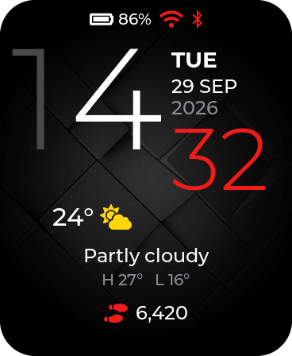 Digital</td>
<td align="center">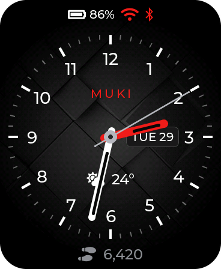 Analog</td>
<td align="center">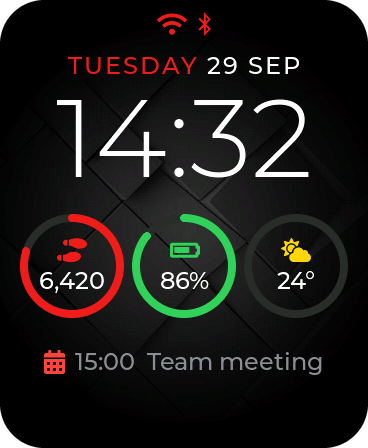 Modular</td>
<td align="center">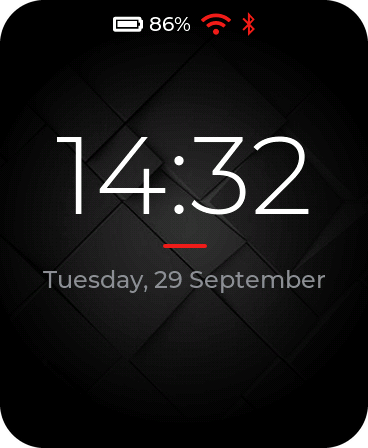 Minimal</td>
</tr>
<tr>
<td align="center">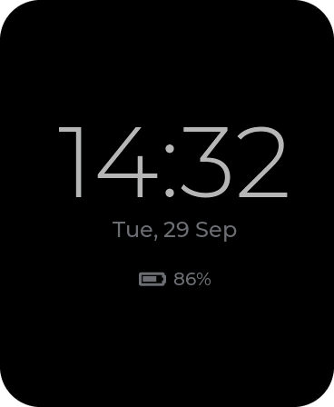 Always-on display</td>
<td align="center">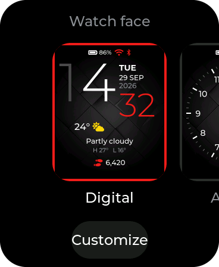 Watch face picker</td>
<td align="center">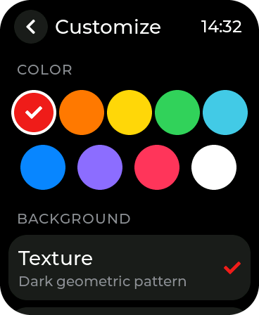 Customize</td>
<td align="center">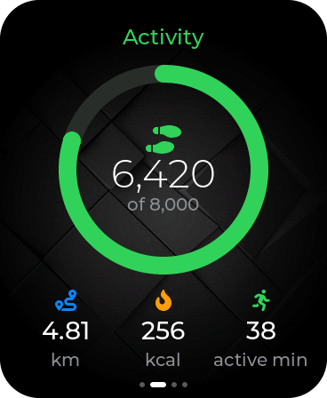 Activity tile</td>
</tr>
<tr>
<td align="center">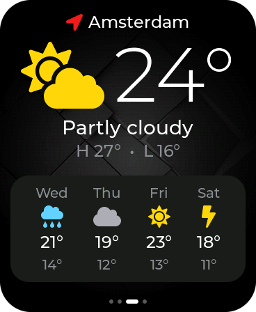 Weather tile</td>
<td align="center">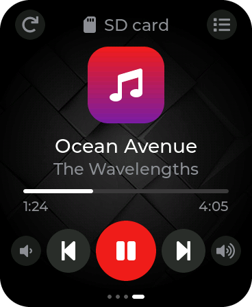 Music tile</td>
</tr>
</table>

## System

<table>
<tr>
<td align="center"> App launcher</td>
<td align="center">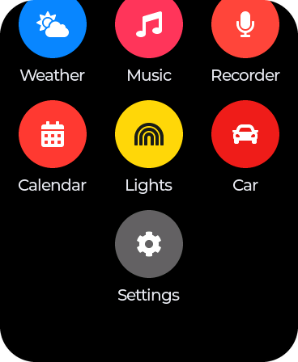 App launcher with extras</td>
<td align="center"> Quick settings</td>
<td align="center">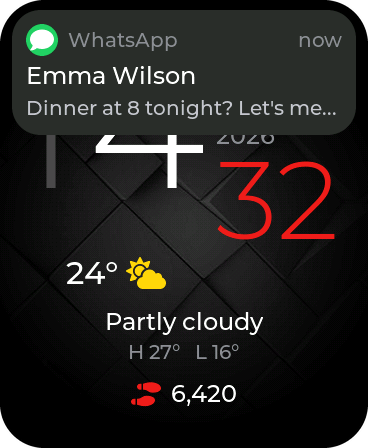 Notification banner</td>
</tr>
<tr>
<td align="center"> Notification center</td>
<td align="center">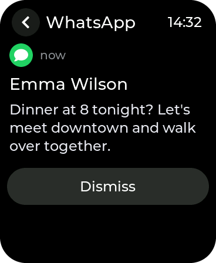 Notification</td>
<td align="center"> Incoming call</td>
<td align="center">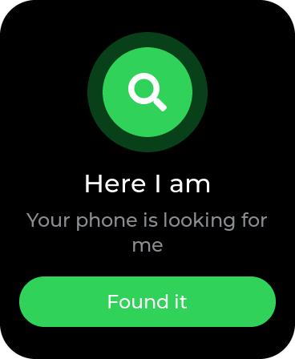 Find my watch</td>
</tr>
<tr>
<td align="center">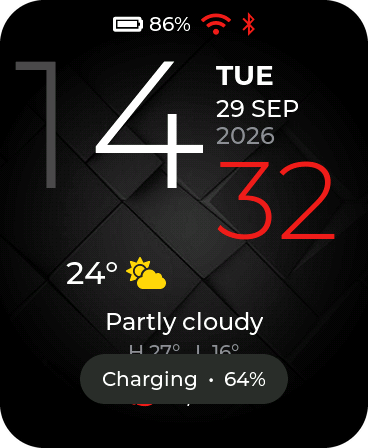 Charging</td>
<td align="center">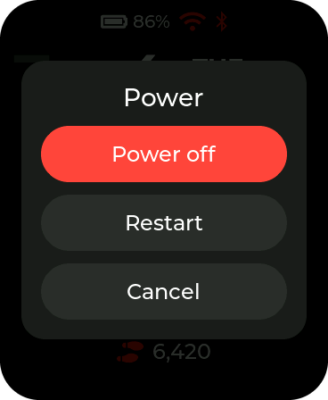 Power menu</td>
</tr>
</table>

## Apps

<table>
<tr>
<td align="center"> Activity</td>
<td align="center">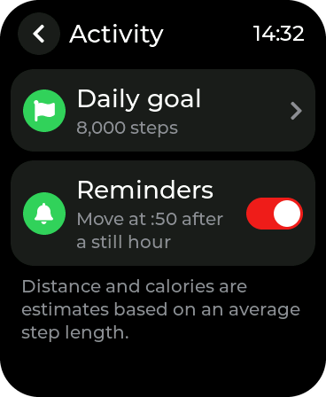 Activity goal and reminders</td>
<td align="center">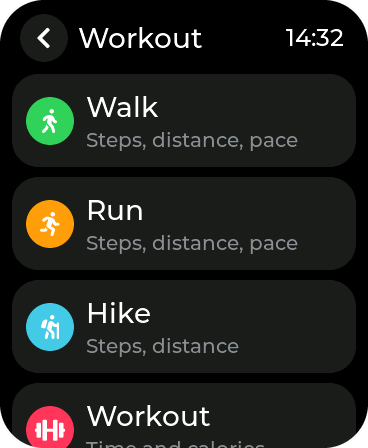 Workout types</td>
<td align="center"> Live workout</td>
</tr>
<tr>
<td align="center">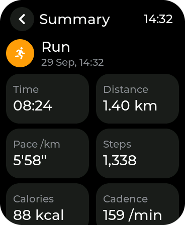 Workout summary</td>
<td align="center"> Last night</td>
<td align="center">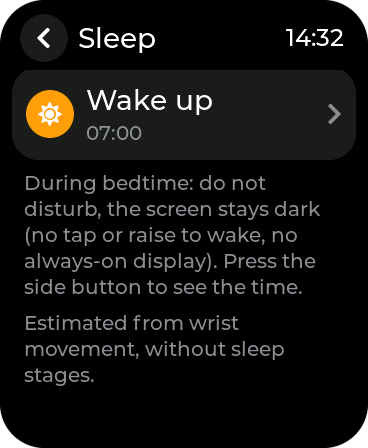 Bedtime schedule</td>
<td align="center"> Alarms</td>
</tr>
<tr>
<td align="center">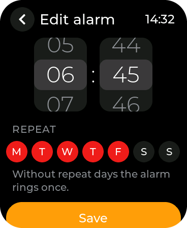 Edit alarm</td>
<td align="center">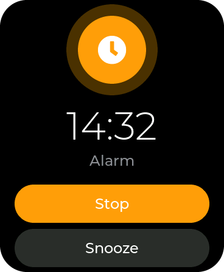 Alarm ringing</td>
<td align="center">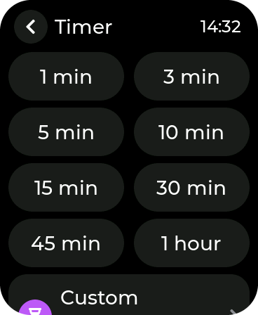 Timer presets</td>
<td align="center"> Timer running</td>
</tr>
<tr>
<td align="center">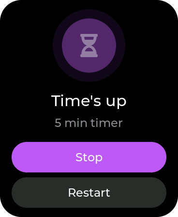 Timer done</td>
<td align="center"> Stopwatch with laps</td>
<td align="center"> Calendar</td>
<td align="center"> Weather</td>
</tr>
<tr>
<td align="center">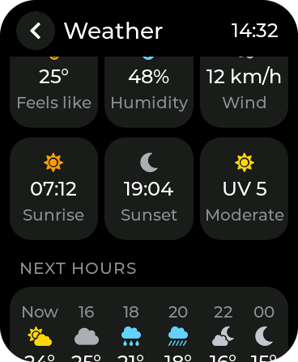 Details and next hours</td>
<td align="center">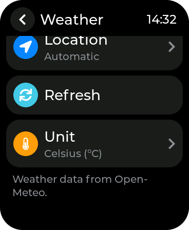 5-day forecast</td>
<td align="center">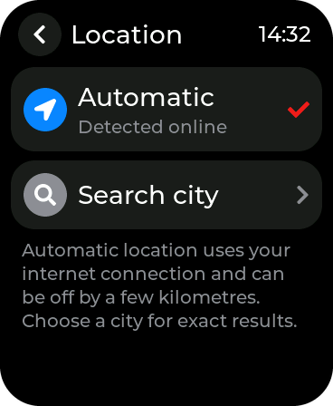 Location</td>
<td align="center">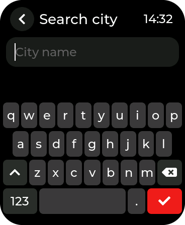 City search keyboard</td>
</tr>
<tr>
<td align="center"> Music player</td>
<td align="center">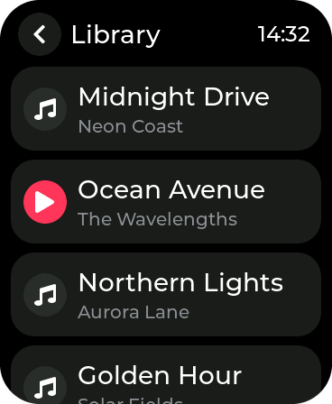 Music library</td>
<td align="center">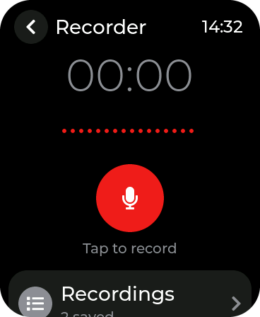 Recorder</td>
<td align="center"> Recording</td>
</tr>
<tr>
<td align="center">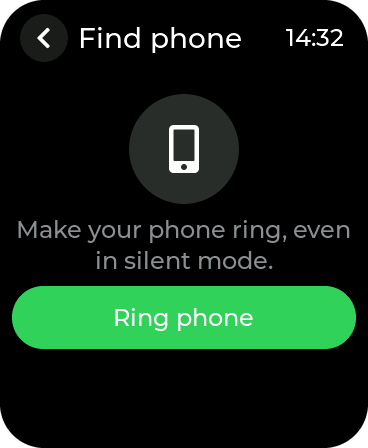 Find my phone</td>
</tr>
</table>

## Extras

<table>
<tr>
<td align="center">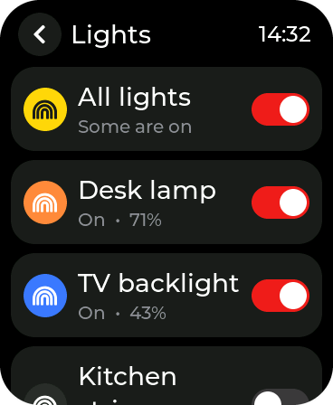 WLED lights</td>
<td align="center">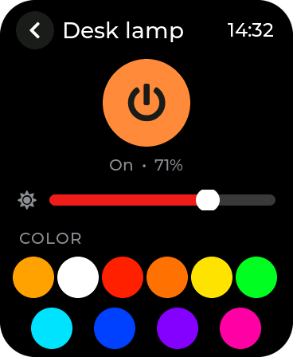 Light control</td>
<td align="center">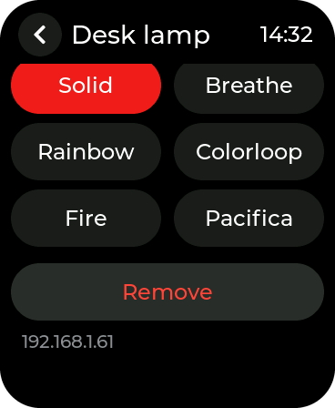 Light effects</td>
<td align="center">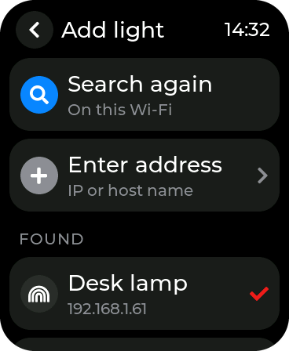 Add a light</td>
</tr>
<tr>
<td align="center">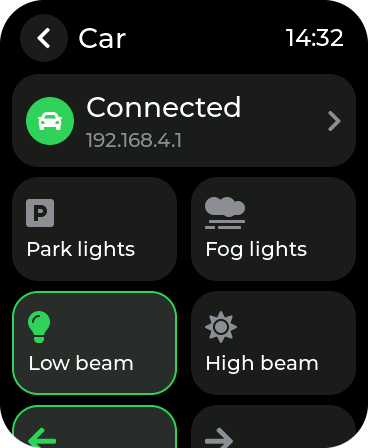 Car control</td>
<td align="center">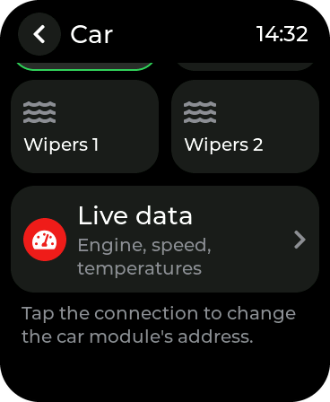 Car control (more)</td>
<td align="center">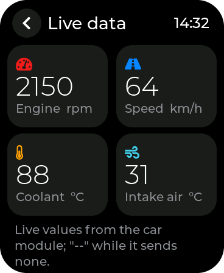 Car live data</td>
</tr>
</table>

## Settings

<table>
<tr>
<td align="center"> Settings</td>
<td align="center">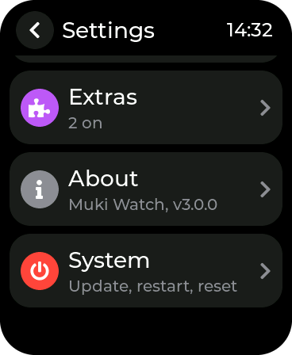 Settings (more)</td>
<td align="center">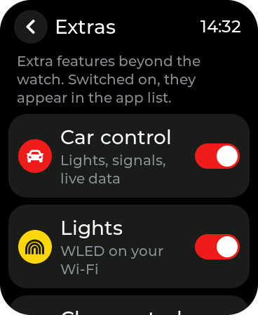 Extras</td>
<td align="center">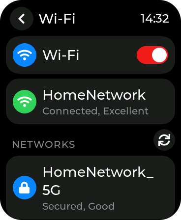 Wi-Fi</td>
</tr>
<tr>
<td align="center">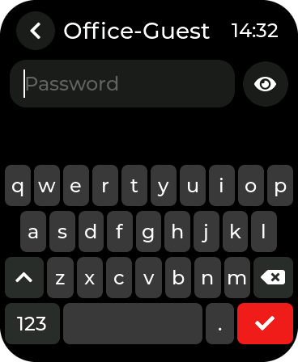 Wi-Fi password</td>
<td align="center">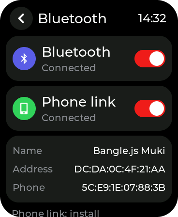 Bluetooth</td>
<td align="center">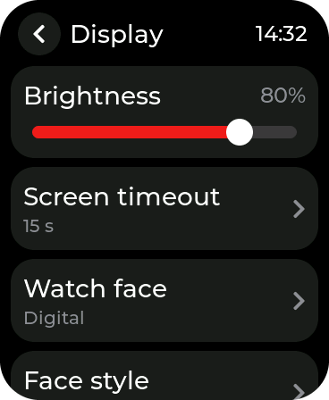 Display</td>
<td align="center"> Wake up</td>
</tr>
<tr>
<td align="center">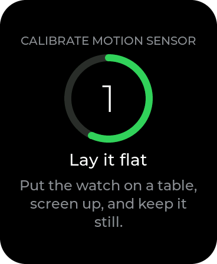 Motion sensor calibration</td>
<td align="center">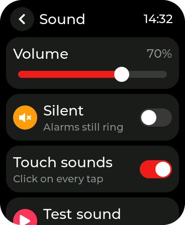 Sound</td>
<td align="center">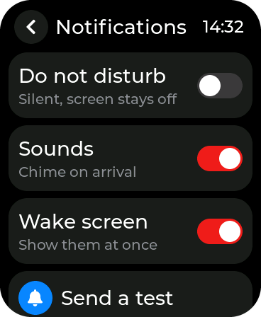 Notifications</td>
<td align="center">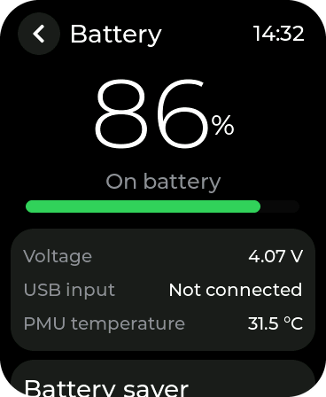 Battery</td>
</tr>
<tr>
<td align="center">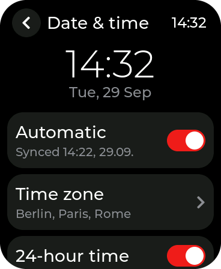 Date and time</td>
<td align="center">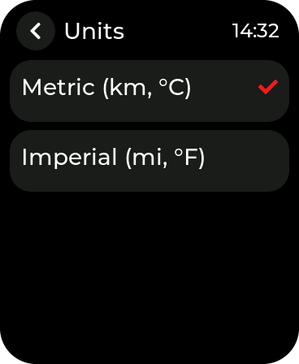 Units</td>
<td align="center"> About</td>
<td align="center"> About (more)</td>
</tr>
<tr>
<td align="center"> System</td>
<td align="center"> Wireless update</td>
</tr>
</table>
